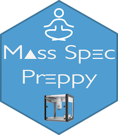

# MassSpecPreppy - an end-to-end solution for automated protein concentration determination and flexible sample digestion for proteomics applications

In proteomics, fast, efficient and highly reproducible sample preparation is of utmost importance, particularly in view of fast scanning mass spectrometers enabling analyses of large sample series. To address this need, we have developed the web application MassSpecPreppy that operates on the open science OT-2 liquid handling robot from Opentrons. This platform can prepare up to 96 samples at once, performing tasks like BCA protein concentration determination, sample digestion with normalization, reduction/alkylation and peptide elution into vials or loading specified peptide amounts onto Evotips in an automated and flexible manner. The performance of the developed workflows using MassSpecPreppy was compared with standard manual sample preparation workflows. The BCA assay experiments revealed an average recovery of 101.3% (SD: ±7.82%) for the MassSpecPreppy workflow, while the manual workflow had a recovery of 96.3% (SD: ±9.73%). The species mix used in the evaluation experiments showed that 94.5% of protein groups for OT-2 digestion and 95% for manual digestion passed the significance thresholds with comparable peptide level coefficient of variations. These results demonstrate that MassSpecPreppy is a versatile and scalable platform for automated sample preparation, producing injection-ready samples for proteomics research.

## citation

Reder, A. et al. MassSpecPreppy—An end‐to‐end solution for automated protein concentration determination and flexible sample digestion for proteomics applications. PROTEOMICS (2023) <doi:10.1002/pmic.202300294>.

<https://dx.doi.org/10.1002/pmic.202300294>
