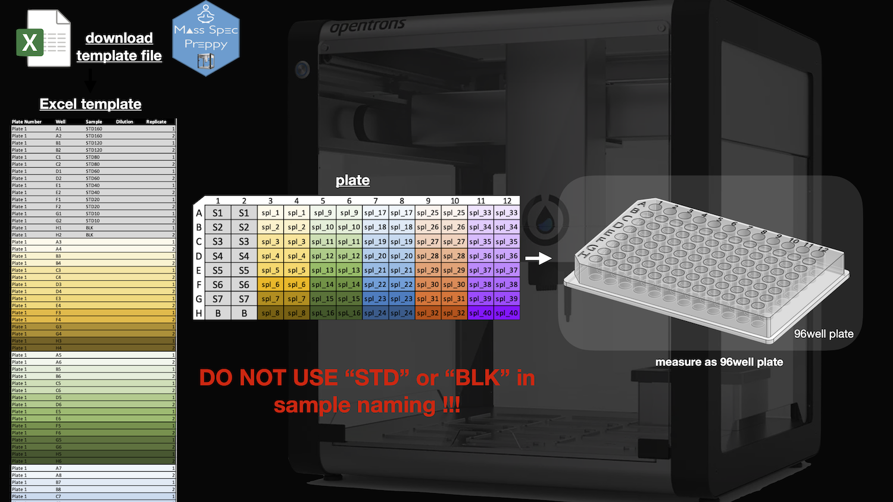
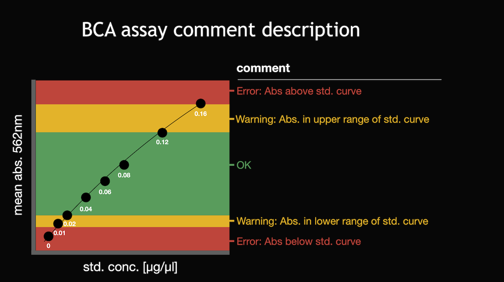

# usage

The usage of the app is fairly simple. Just download the excel template
for your sample description (sample name, dilution factor, replicate).
The edited excel table can then be uploaded together with the excel file
output from the Gen5 software (Synergy H1 plate reader).

DO NOT USE “STD” or “BLK” in
sample naming !!!.

# 96 well plate measurements

The 96well plate can be measured in “normal” read mode in the Synergy H1
as well.

Please download the Excel template from the app to provide the meta data
of your samples to the app.

# comment column in output

The app will export all relevant data and the samples will get a comment
field. Please make sure that your dilution of samples is measured in the
acceptable (“OK”) range.

