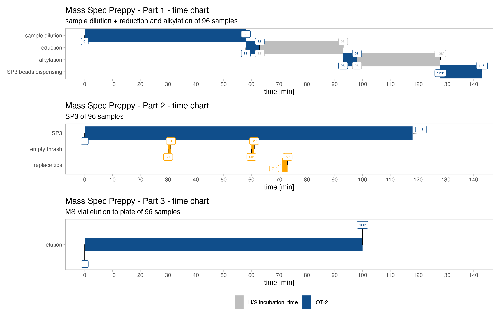

```{r global.options, include = F}
knitr::opts_chunk$set(
    cache       = FALSE,     # if TRUE knitr will cache the results to reuse in future knits
    fig.align   = 'center', # how to align graphics in the final doc. 'left', 'right', 'center'
    fig.path    = 'figures/',  # file path to the directory where knitr shall store the graphics files
    echo        = TRUE,     # in FALSE knitr will not display code in the code chunk above it's results
    message     = TRUE,     # if FALSE knitr will not display any messages generated by code
    eval        = TRUE,     # if FALSE knitr will not display any messages generated by code
    strip.white = TRUE,     # if FALSE knitr will not remove white spaces at the beg or end of code chunk
    warning     = FALSE,
    cols.min.print = 10,
    highlight = T,
    rows.print = 10)    # if FALSE knitr will not display any warning messages in the final document
```


  <!-- setup and insert packages -->  

```{r setup, include=FALSE}
knitr::opts_chunk$set(echo = TRUE)
suppressMessages(library(tidyverse))
suppressMessages(library(DT))
suppressMessages(library(kableExtra))
suppressMessages(library(readxl))
suppressMessages(library(htmltools))
suppressMessages(library(htmlwidgets))

```

  <!-- include logo -->  

```{r, echo=FALSE}
htmltools::img(src = knitr::image_uri("Mass_Spec_Preppy_hexbin_small.png"), 
               alt = 'logo', 
               style = 'position:absolute; top:50px; right:0; padding:10px;width: 300;height: 153px;')
```

**filename:** <span style="color:#4A7CB3; font-weight: bold; font-size:18.0pt">`r params$file_name`</span>

# Things to pay attention

## Thrash fill level:

Always watch fill level of thrash. If thrash is full please click on "pause" empty trash and click "resume".


# Mass Spec Preppy - Inputs

- number of samples: **`r params$number_of_samples`**
- reduction & alkylation: **`r params$reduction_and_alkylation`**
- sample amount for digestion (µg): **`r params$sample_amount`**
- LysC/trypsin Mix ratio (xfold): **`r params$LysC_Trypsin_Mix_ratio`**
- LysC/trypsin stock centration (ng/µl): **`r params$LysC_Trypsin_Mix_concentration`**
- trypsin ratio (xfold): **`r params$trypsin_ratio`**
- trypsin stock centration (ng/µl): **`r params$trypsin_stock_concentration`**
- LysC ratio (xfold): **`r params$LysC_ratio`**
- LysC stock centration (ng/µl): **`r params$LysC_stock_concentration`**
- elution of peptides in: **`r params$EvoTips_vials`**

## sample list

<span style="color:red; font-weight: bold;">samples should be well resolubilized and all liquid should be at the bottom of the reaction vessel</span>

```{r,echo=F}
datatable(params$sample_list,options = list(
            columnDefs = list(list(className = 'dt-center', targets = "_all"))
            ))
```

# Protocol step 1 - sample preparation

<span style="color:red; font-weight: bold;">Always perform labware calibration before starting this protocol at the OT-2 app</span>

**please provide WITHOUT AIR BUBBLES:**

- 1x sample buffer
- 12.5mM DTT in water (freshly prepared) *[only when reduction and alkylation is being used]*
- 50mM IAA in water (freshly prepared) *[only when reduction and alkylation is being used]*
- 50µg/µl SP3 beads (mix of hyrdophilic and hydrophobic beads)

```{r,echo=F}
knitr::include_graphics(params$deck_plot1)
```

## Protocol step 1 - sample preparation - steps

```{r,echo=F}
step1 <- tibble::tribble(
  ~"step",	~"pipette",	~"transfer volume [µl]",	~"sample volume [µl] after step",	~"descritpion",
  "1",	"single channel P20",	"variable",	"variable",	"transfer the calculated volume of dilution buffer to preparation plate (for a final volume of 10µl)",
  "2",	"single channel P20",	"variable",	"variable",	"transfer and mix the calculated volume of sample  to preparation plate (final volume will be 10µl)",
  "3",	"8-channel P20",	"2.5",	"12.5",	"transfer and mix 2.5µl of 12.5mM DTT to sample for reduction",
  "4","","","","pause step: incubate 30 minutes at 37°C",
  "5",	"8-channel P20",	"3.125",	"15.625",	"transfer and mix 3.125µl of 50mM IAA to sample for alkylation",
  "6","","","","pause step: incubate 15 minutes at 37°C",
  "7",	"8-channel P20",	"5",	"20.625",	"transfer 5µl of 50µg/µl SP3 bead stock to sample (preparation plate)")

DT::datatable(step1,rownames= FALSE,options = list(pageLength = nrow(step1),
                                   initComplete = htmlwidgets::JS("function(settings, json) {",
                                                    "$(this.api().table().header()).css({'background-color': '#000', 'color': '#fff'});",
                                                    "}")))

```

# Protocol step 2 -  SP3 digest - steps

<span style="color:red; font-weight: bold;">Always perform labware calibration before starting this protocol at the OT-2 app</span>

**please provide WITHOUT AIR BUBBLES:**

- 95% acetonitril (ACN) >> waste will be collected in A11 and A12 position of reagent plate (!!! proper disposal of  ACN !!!)
- 80% ethanol (EtOH)
- digest buffer (50mM Tris/HCl 1mM CaCl~2~ pH8 at 37°C >> this means pH 8.3 at 25°C; must be very accurate !!!)
- `r params$LysC_stock_concentration` ng/µl LysC stock solution in H~2~O (add in reagent plate before starting the protocol)
- `r params$trypsin_stock_concentration` ng/µl trypsin stock solution in 50mM acetic acid (add in reagent plate after 3h LysC incubation)
- `r params$LysC_Trypsin_Mix_concentration` ng/µl LysC/Trypsin Mix stock solution in 50mM acetic acid
- incubation at 37°C should be performed with MixMate at 1500rpm

```{r,echo=F}
knitr::include_graphics(params$deck_plot2)
```

## Protocol step 2 -  SP3 digest

```{r,echo=F}
if(is.na(params$LysC_ratio)){
  step2 <- tibble::tribble(
  ~"step",	~"pipette",	~"transfer volume [µl]",	~"sample volume [µl] after step",	~"descritpion",
  "1",	"8-channel P300",	"110",	"130.625",	"transfer 95% ACN on sample for binding (final 80% ACN) and mixing 15x 100µl",
  "2","","","","pause step: incubate 5 minutes for binding",
  "3","","","","magnet module: raise magnet 12mm and incubate for 3 minutes",
  "4",	"8-channel P300",	"140",	"0",	"remove slowly (1/8 of speed) the supernatant with and 1.5mm offset to the side and 0.5mm from the bottom",
  "5","","","","magnet module: lower magnet 12mm and incubate for 3 minutes",
  "6",	"8-channel P300",	"150",	"150",	"wash beads with 150µl 80% ethanol",
  "7","","","","magnet module: raise magnet 12mm and incubate for 3 minutes",
  "8",	"8-channel P300",	"155",	"0",	"remove slowly (1/8 of speed) the supernatant with and 1.5mm offset to the side and 0.5mm from the bottom",
  "9","","","","magnet module: lower magnet 12mm and incubate for 3 minutes",
  "10",	"8-channel P300",	"150",	"150",	"wash beads with 150µl 80% ethanol",
  "11","","","","magnet module: raise magnet 12mm and incubate for 3 minutes",
  "12",	"8-channel P300",	"155",	"0",	"remove slowly (1/8 of speed) the supernatant with and 1.5mm offset to the side and 0.5mm from the bottom",
  "13","","","","magnet module: lower magnet 12mm and incubate for 3 minutes",
  "14",	"8-channel P300",	"150",	"150", "wash beads with 150µl 95% acetonitril",
  "15","","","","magnet module: raise magnet 12mm and incubate for 3 minutes",
  "16",	"8-channel P300",	"170",	"0",	"remove slowly (1/8 of speed) the supernatant with and 1.5mm offset to the side and 0.5mm from the bottom",
  "17","","","","delay: pause for 15 minutes to air dry beads and automatically resume",
  "18",	"8-channel P20",	"variable",	"variable",	"transfer the calculated volume of digestion buffer buffer to preparation plate (for a final volume of 22µl)",
    "19",	"8-channel P20",	"variable",	"2",	"transfer the calculated volume of LysC/Trypsin Mix stock to preparation plate (to a final volume of 22µl)",
  "20","","","","place plate in MixMate for 5 minutes at 3000 rpm; 5 min. sonication, incubate over night at 37°C")
}else{
  step2 <- tibble::tribble(
  ~"step",	~"pipette",	~"transfer volume [µl]",	~"sample volume [µl] after step",	~"descritpion",
  "1",	"8-channel P300",	"110",	"130.625",	"transfer 95% ACN on sample for binding (final 80% ACN) and mixing 15x 100µl",
  "2","","","","pause step: incubate 5 minutes for binding",
  "3","","","","magnet module: raise magnet 12mm and incubate for 3 minutes",
  "4",	"8-channel P300",	"140",	"0",	"remove slowly (1/8 of speed) the supernatant with and 1.5mm offset to the side and 0.5mm from the bottom",
  "5","","","","magnet module: lower magnet 12mm and incubate for 3 minutes",
  "6",	"8-channel P300",	"150",	"150",	"wash beads with 150µl 80% ethanol",
  "7","","","","magnet module: raise magnet 12mm and incubate for 3 minutes",
  "8",	"8-channel P300",	"155",	"0",	"remove slowly (1/8 of speed) the supernatant with and 1.5mm offset to the side and 0.5mm from the bottom",
  "9","","","","magnet module: lower magnet 12mm and incubate for 3 minutes",
  "10",	"8-channel P300",	"150",	"150",	"wash beads with 150µl 80% ethanol",
  "11","","","","magnet module: raise magnet 12mm and incubate for 3 minutes",
  "12",	"8-channel P300",	"155",	"0",	"remove slowly (1/8 of speed) the supernatant with and 1.5mm offset to the side and 0.5mm from the bottom",
  "13","","","","magnet module: lower magnet 12mm and incubate for 3 minutes",
  "14",	"8-channel P300",	"150",	"150", "wash beads with 150µl 95% acetonitril",
  "15","","","","magnet module: raise magnet 12mm and incubate for 3 minutes",
  "16",	"8-channel P300",	"170",	"0",	"remove slowly (1/8 of speed) the supernatant with and 1.5mm offset to the side and 0.5mm from the bottom",
  "17","","","","delay: pause for 15 minutes to air dry beads and automatically resume",
  "18",	"8-channel P20",	"variable",	"variable",	"transfer the calculated volume of digestion buffer buffer to preparation plate (for a final volume of 22µl)",
    "19",	"8-channel P20",	"variable",	"2",	"transfer the calculated volume of LysC stock to preparation plate (to a final volume of 20µl)",
  "20","","","","place plate in MixMate for 5 minutes at 3000 rpm; 5 min. sonication, incubate 3h at 37°C), put plate back, replace 20µl tip boxes !!!  resume",
  "21","","","","magnet module: raise magnet 12mm and incubate for 3 minutes",
  "22",	"8-channel P20",	"variable",	"variable",	"transfer the calculated volume of trypsin stock to preparation plate (to a final volume of 22µl)",
    "23","","","","magnet module: lower magnet 12mm",
    "24","","","","place plate in MixMate for 5 minutes at 3000 rpm, incubate over night at 37°C at 1000 rpm")
}


DT::datatable(step2,rownames= FALSE,options = list(pageLength = nrow(step2),
                                   initComplete = htmlwidgets::JS("function(settings, json) {",
                                                    "$(this.api().table().header()).css({'background-color': '#000', 'color': '#fff'});",
                                                    "}")))

```

# Protocol step 3 -  elution after digest

<span style="color:red; font-weight: bold;">Always perform labware calibration before starting this protocol at the OT-2 app</span>

<span style="color:green; font-weight: bold;">Shake plate 5 minutes before placing into the OT-2 robot</span>

**please provide WITHOUT AIR BUBBLES:**

- 5% TFA (Trifluoroacetic acid)

```{r,echo=F}
knitr::include_graphics(params$deck_plot3)
```

## Protocol step 3 -  elution after digest - steps


```{r,echo=F}
step3 <- tibble::tribble(
  ~"step",	~"pipette",	~"transfer volume [µl]",	~"sample volume [µl] after step",	~"descritpion",
  "1",	"8-channel P20",	"2.44",	"24.44",	"transfer of 5% TFA to stop the digest (0.5% TFA final conc.)",
  "2",	"single channel P20",	"24",	"0.4",	"transfer 24µl from preparation plate to MS vial",
)

DT::datatable(step3,rownames= FALSE,options = list(pageLength = nrow(step3),
                                   initComplete = htmlwidgets::JS("function(settings, json) {",
                                                    "$(this.api().table().header()).css({'background-color': '#000', 'color': '#fff'});",
                                                    "}")))

```

# Mass Spec Preppy - time chart example with reduction and alkylation (N = 96)

